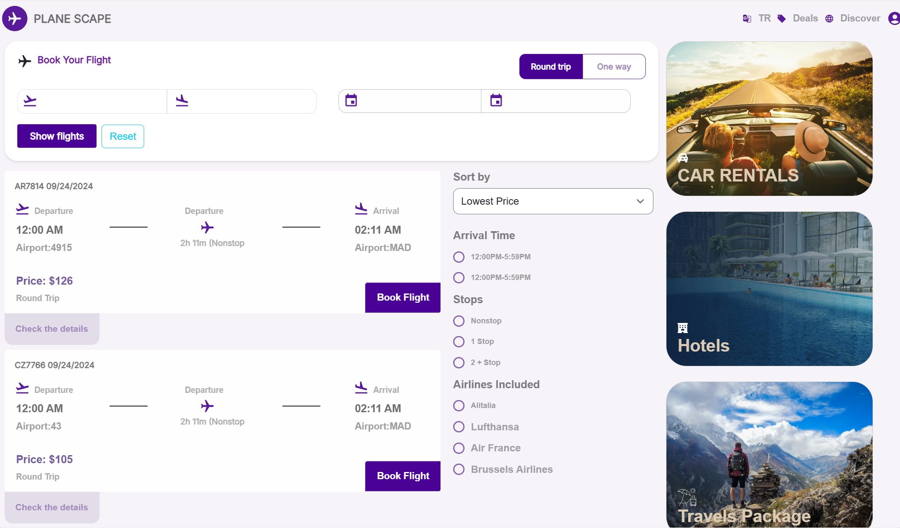
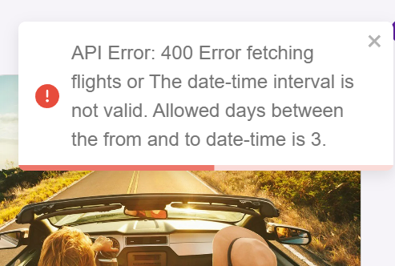

# Overview

Fellas is a React application designed to connect with a backend API for airline destinations and flight
bookings. The application supports multiple languages, currently English and Turkish, and provides various features
including flight filtering, booking, and real-time updates.

# Prerequisites

Ensure you have `npm` and node installed on your local machine.

To check if `npm` is installed, run:

```
npm -v
```

To check if `node` is installed, run:

```
node -v
```

If these commands are not recognized, you can install Node.js and npm
from [Node.js Downloads](https://nodejs.org/en/download/package-manager).

Linux Installation
For Linux users, install Node.js and npm using the following commands:

```
sudo apt update
sudo apt install nodejs
sudo apt install npm
nodejs -v # to check Node.js version
npm -v # to check npm version

```

For more detailed instructions, refer to
this [DigitalOcean tutorial.](https://www.digitalocean.com/community/tutorials/how-to-install-node-js-on-ubuntu-18-04)

# Getting Started

1- Clone the repository:

```
git clone https://github.com/HammudElHammud/airline-flights.git
cd airline-flights

```

2- Install dependencies:

```
npm install --force

```

3- Run the application:

```
npm start

```

Open [http://localhost:3000](http://localhost:3000) to view the application in your browser. The page will reload when
you make changes and you
may see lint errors in the console.

# Environment Configuration

The project connects to a backend API that should run on [http://localhost:4000](http://localhost:4000). If you need to
change this, update the .env file in the project root.

The `.env` file includes:

```
SKIP_PREFLIGHT_CHECK=true
REACT_APP_BASE_DASHBOARD_URL=/
BACKEND_API_URL=http://localhost:4000/

```

# Features
- Multi-language Support: 
  The application supports Turkish and English. Language can be switched from the header.
- Real-time Flight Search:
  Filter flights based on various criteria. The auto-complete feature connects with airlines and
  destinations.
- Date Range Limitation:
  The API only accepts a date range of up to 3 days. Attempting to filter beyond this range will
  trigger an alert.
- Loading and Empty States:
  Displays loading indicators while fetching data and appropriate messages when no flights are
  found.
- Flight Booking:
  Allows booking flights with validation to prevent duplicate bookings or bookings for past flights.

# Development Workflow
We follow the Gitflow workflow. Never make changes directly to the master branch. Learn more about Gitflow [here](https://www.atlassian.com/git/tutorials/comparing-workflows/gitflow-workflow#:~:text=Gitflow%20is%20a%20legacy%20Git,software%20development%20and%20DevOps%20practices).

# Screenshots

 - Home Page
   

 - Language Switcher
 
   


 - Filters and Results





